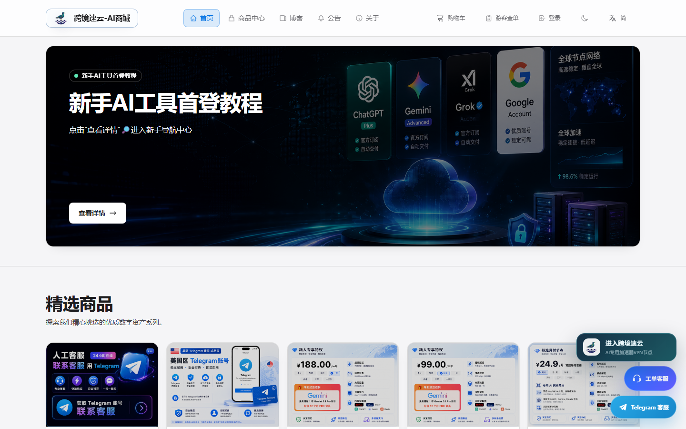
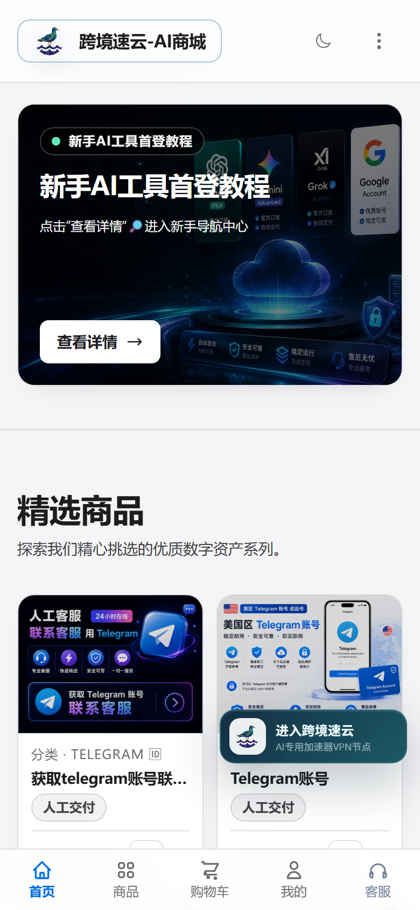
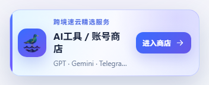
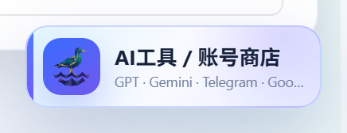
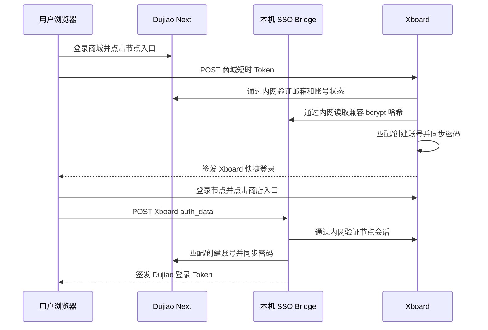

# Dujiao Next ↔ Xboard 双向账号桥接

[](LICENSE)


将 **Dujiao Next AI 工具/账号商城**与 **Xboard 节点网站**连接成一套账号体验：用户只需同一个邮箱和密码，即可双向一键登录，也可以分别在两个网站的原生登录页独立登录。

> 本仓库只提供二次开发集成层，不包含 Dujiao Next、Xboard 商业源码，也不包含真实域名、服务器 IP、密钥、数据库或用户数据。

## 这个项目解决什么问题

- 用户在商城登录后，点击卡片直接进入节点仪表盘，不再重复输入密码。
- 用户在节点网站登录后，点击卡片直接进入 AI 工具/账号商店。
- 目标网站没有同邮箱账号时自动创建，不需要管理员手工开账号。
- 两边使用 bcrypt 时同步密码哈希；整个过程不读取、不传输明文密码。
- 完成一次跨站关联后，同一邮箱和密码可以分别登录两个网站。
- 桌面端、手机端都有响应式入口，并兼容日间/夜间主题。
- 手机端客服入口收进底部导航，避免悬浮卡片挡住菜单和页面滑动。

## 服务器当前实际效果

以下截图在 **2026-08-02** 直接使用线上正在运行的页面、DOM、CSS 和 JS 生成；没有使用 README 旧版示意卡片，也没有包含用户账号或 Token。仓库 `templates/production/` 中的模板与线上组件同源，只把域名、Telegram 和资源路径改成了安装变量。

### 1. AI 商城 → 节点网站

商城右下角为当前线上完整悬浮组件：节点入口、工单客服和 Telegram 客服。手机端只保留紧凑节点入口，客服折叠进底部导航。





### 2. 节点网站 → AI 工具/账号商店

节点网站使用当前线上右下角商店悬浮卡片，登录用户点击后通过 SSO 自动进入商城。



### 3. 手机端紧凑入口

移动端卡片缩小为 `186 × 50px` 左右，隐藏独立客服悬浮按钮，并避开底部菜单、“回到顶部”和滑动区域。



## 二开功能一览

| 功能 | 用户看到的效果 | 服务端行为 |
| --- | --- | --- |
| Dujiao → Xboard SSO | 商城一键进入节点仪表盘 | 校验商城 Token，匹配或创建 Xboard 用户并签发快捷登录 |
| Xboard → Dujiao SSO | 节点网站一键进入 AI 商店 | 校验 `auth_data`，匹配或创建 Dujiao 用户并签发商城 JWT |
| 同邮箱账号映射 | 两边显示同一个账号 | 只接受格式正确、已验证且未禁用的邮箱 |
| 密码共享 | 两边可用同一密码独立登录 | 仅复制兼容的 bcrypt 哈希，不接触密码明文 |
| 旧账号兼容 | 原有账号也能逐步统一 | 第一次跨站时，以发起跳转一侧的密码为准 |
| 跳转白名单 | 只能进入允许页面 | 限制 `dashboard`、`tickets`、`plan` 等目标，防止开放重定向 |
| 跨站入口卡片 | Logo、标题、副标题、日夜主题 | 原生 JavaScript/CSS，无额外前端依赖 |
| 手机端适配 | 不挡底栏、不影响滑动 | 透明容器不接收点击，仅实际按钮响应事件 |
| 客服入口折叠 | 工单和 Telegram 客服进入底部菜单 | 关闭时不保留透明遮罩 |
| 注册入口强化 | 登录页注册按钮更加醒目 | 可通过主题 CSS/JS 注入，不改核心认证逻辑 |
| 安全部署与回滚 | 升级失败可快速恢复 | 本机凭据端口、最小权限、时间戳备份和健康检查 |

更完整的实现范围见 [二开功能详细说明](docs/FEATURES.md)。

## 密码共享规则（部署前必读）

两个网站都必须使用兼容的 bcrypt 密码哈希。桥接不会解密密码，也不会记录密码明文。

| 场景 | 结果 |
| --- | --- |
| 商城已有账号，节点没有账号 | 第一次从商城跳转时创建节点账号，并使用商城密码 |
| 节点已有账号，商城没有账号 | 第一次从节点跳转时创建商城账号，并使用节点密码 |
| 两边同邮箱但密码不同 | 最后从哪一侧发起跨站登录，就以哪一侧密码同步到另一侧 |
| 两边邮箱不同 | 视为两个独立账号，不会自动合并 |
| 用户后来修改了其中一侧密码 | 从改密一侧再跨站一次，即可重新同步 |

## 工作原理



凭据接口仅监听 `127.0.0.1`，不会公开到互联网。架构和数据流详见 [架构说明](docs/ARCHITECTURE.md)。

## 一条命令部署

适合的参考环境：两个网站位于同一台 Linux VPS，Nginx 对外提供 HTTPS，Dujiao Next 使用 SQLite，Xboard 使用 MySQL/MariaDB。

部署前准备好：

- 两个已经可以正常登录的网站；
- 两个 HTTPS 域名；
- root 或 sudo 权限；
- Dujiao 根目录、数据库路径；
- Xboard 根目录、`.env` 路径；
- 一个专门用于测试的邮箱账号。

在 Ubuntu/Debian 服务器中执行下面一条命令：

```bash
curl -fsSL https://raw.githubusercontent.com/bimaidalao/dujiao-xboard-sso-bridge/main/bootstrap.sh | sudo bash
```

它会自动下载项目并启动交互式安装器。用户只需按提示确认两个项目目录、两个域名、Nginx 配置和服务用户。安装器会：

1. 自动查找程序路径；
2. 填写部署参数表；
3. 一键生成时间戳备份；
4. 复制 Xboard 控制器并添加路由；
5. 安装 Dujiao 桥接和 systemd 服务；
6. 添加 Nginx 固定路由；
7. 安装与当前生产服务器同源的桌面端、手机端入口和 Logo；
8. 清理缓存并启动服务；
9. 用临时账号验证双向登录和密码共享；
10. 出错时按原路径快速回滚。

只想检查自动识别结果、不修改服务器：

```bash
sudo /opt/dujiao-xboard-sso-bridge/bin/dx-bridge install --dry-run
```

安装器支持配置文件无人值守模式：

```bash
cp install.env.example install.env
nano install.env
sudo bin/dx-bridge install --config install.env --yes
```

> 一键不等于盲改。脚本会在 `/var/backups/dujiao-xboard-sso-bridge/` 创建时间戳备份；无法确认 Xboard 路由、Nginx server block 或文件权限时会停止，不会使用 `chmod 777`，也不会把凭据端口开放到公网。

## 仓库结构

```text
dujiao/public/          Xboard → Dujiao 桥接入口、本机凭据接口
xboard/                 Dujiao → Xboard Laravel 控制器、路由片段
templates/production/   从当前生产服务器提取并参数化的真实前端组件
bootstrap.sh            单网址下载与启动入口
install.sh              交互式/无人值守一键安装器
check-install.sh        安装后的健康检查
bin/dx-bridge           安装、更新、检查、校验和回滚的统一命令
lib/                    安装器共享函数，避免根脚本重复堆叠
scripts/                发布校验与安全回滚脚本
deploy/                 Nginx、systemd 配置示例
docs/images/            已脱敏的真实效果截图
docs/                   功能、架构、部署、安全和故障排查文档
```

## 安全边界

- 公开网络只接收当前用户的短时会话令牌，不接收密码明文。
- 密码哈希接口仅监听本机，并再次验证来源用户会话。
- 只同步邮箱、状态和兼容 bcrypt 哈希。
- 工单只同步当前用户两边最近订单的必要摘要；不同步卡密、自动发货内容、密码、管理员权限或完整支付信息。
- 不要把真实 `.env`、数据库、备份、日志或密钥提交到 GitHub。
- Dujiao Next 或 Xboard 升级后，应先在测试环境重新验证字段和认证流程。

上线前请阅读 [安全说明](docs/SECURITY.md)；遇到 401、403、500、跳转循环或手机端遮挡时查看 [故障排查](docs/TROUBLESHOOTING.md)。

## 文档导航

- [成品仓库结构与维护方式](docs/REPOSITORY.md)
- [AI 商店订单关联工单与手机端遮挡修复](docs/ORDER_TICKET_LINK.md)

- [二开功能详细说明](docs/FEATURES.md)
- [生产服务器基线与资源哈希](docs/PRODUCTION_BASELINE.md)
- [傻瓜式完整部署教程](docs/DEPLOYMENT.md)
- [架构与数据流](docs/ARCHITECTURE.md)
- [安全说明](docs/SECURITY.md)
- [故障排查与回滚](docs/TROUBLESHOOTING.md)

## License

本集成层使用 [MIT License](LICENSE)。使用者仍需自行确认 Dujiao Next、Xboard 以及所用主题资源的许可证和二次开发条款。
