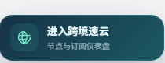
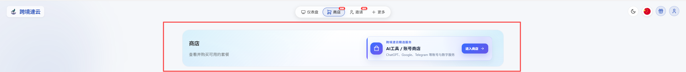
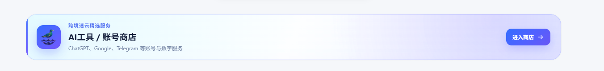
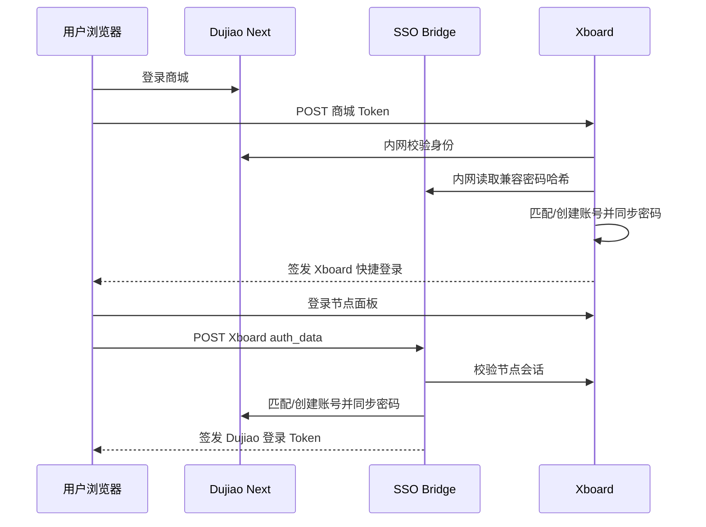

# Dujiao Next ↔ Xboard 双向账号桥接

面向 Dujiao Next 商城与 Xboard 节点面板的二次开发项目。它把两个独立系统连接为一套用户体验：同邮箱账号、双向一键登录、可选密码共享、跨站入口、移动端客服入口与安全部署模板。

> 本仓库只包含二开集成层，不包含任何商业站点源码、真实域名、服务器 IP、SSH 私钥、JWT 密钥、数据库或用户数据。

## 效果预览

### 商城进入节点面板



### 节点面板进入 AI 工具商店



### 手机端紧凑入口



## 二开功能

| 功能 | 说明 |
| --- | --- |
| Dujiao → Xboard SSO | 商城用户携带当前会话安全进入节点面板 |
| Xboard → Dujiao SSO | 节点用户一键进入 AI 工具商店 |
| 自动账号映射 | 使用已验证邮箱匹配账号，目标站缺少账号时自动创建 |
| 密码共享 | 两边均为 bcrypt 时同步密码哈希，不传输、不记录明文密码 |
| 独立密码登录 | 完成一次账号关联后，可使用同一邮箱和密码分别登录两个网站 |
| 跳转白名单 | 只允许 dashboard、tickets、plan 等固定目标，阻止开放重定向 |
| 跨站入口卡片 | 支持 Logo、标题、副标题、日夜主题和桌面/手机响应式布局 |
| 手机客服折叠 | 工单与 Telegram 客服可收进底部导航，避免悬浮遮罩影响滑动 |
| 注册入口强化 | 可将登录页注册链接升级为高对比注册按钮 |
| 安全回滚 | 部署前备份，健康检查或双向验证失败时恢复旧版本 |

完整实现边界见 [二开功能说明](docs/FEATURES.md)。

## 工作原理



密码共享采用 bcrypt 哈希同步。系统不会读取明文密码。用户从某一站发起一键登录时，该站的最新密码成为两个系统的共享密码。旧账号首次统一时需要完成一次一键关联。

## 仓库结构

```text
dujiao/public/          Xboard → Dujiao 服务端桥接与本机凭据接口
xboard/                 Dujiao → Xboard Laravel 控制器和路由片段
frontend/               两个网站的跨站入口组件与样式
deploy/                 Nginx、systemd 示例
docs/                   功能、架构、部署、安全、排障和回滚说明
```

## 环境要求

- Linux VPS，推荐 Ubuntu 22.04/24.04 或 Debian 12
- Nginx 1.20+
- Dujiao Next，SQLite 用户数据库
- Xboard，Laravel + MySQL/MariaDB + Redis
- PHP 7.4+ 可运行轻量桥接；Xboard 自身按上游要求使用 PHP 8.2+
- systemd
- 两个公开域名均启用 HTTPS
- 两个系统部署在同一台服务器，或通过受控私网互通

参考生产拓扑和版本差异见 [架构说明](docs/ARCHITECTURE.md)。

## 快速部署

1. 备份两个系统的用户表、应用文件和 Nginx 配置。
2. 从 `.env.example` 创建桥接环境配置，不要提交真实 `.env`。
3. 安装 Xboard 控制器与路由片段。
4. 部署 `dujiao/public/`，只监听 `127.0.0.1`。
5. 添加 Nginx 固定 SSO 路由，不要公开内部凭据接口。
6. 安装 systemd 服务并启动。
7. 加载前端配置、脚本和 CSS。
8. 使用临时账号执行双向 SSO、密码共享、禁用账号和回滚测试。

逐条命令、目录权限、健康检查与回滚流程见 [部署文档](docs/DEPLOYMENT.md)。

## 安全原则

- 公开网络只接收短时会话令牌，不传输密码明文。
- 密码哈希接口仅监听本机，并再次验证当前用户会话。
- 只同步邮箱、账号状态和兼容的 bcrypt 哈希。
- 不同步卡密、交付内容、支付信息、管理员字段或订单隐私数据。
- 升级 Dujiao Next/Xboard 后，先在测试环境核对数据库字段和认证流程。

上线前务必阅读 [安全说明](docs/SECURITY.md) 与 [故障排查](docs/TROUBLESHOOTING.md)。

## 文档

- [二开功能说明](docs/FEATURES.md)
- [架构与数据流](docs/ARCHITECTURE.md)
- [完整部署流程](docs/DEPLOYMENT.md)
- [安全说明](docs/SECURITY.md)
- [故障排查](docs/TROUBLESHOOTING.md)

## License

MIT。使用者需自行确认上游 Dujiao Next、Xboard 及主题资源的许可证与二次开发条款。

