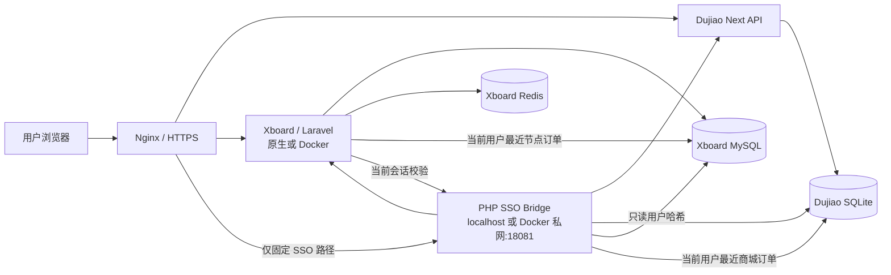

# 架构与数据流

## 组件

## 信任边界

- 浏览器属于不可信网络，只能提交当前站点已有的短时会话凭据；
- Nginx 只公开必要 SSO 路径；
- 凭据接口只允许本机或安装器检测到的 Docker 私网调用；
- 数据库不直接暴露到公网；
- 桥接服务只拥有完成账号映射所需的最小文件与数据库权限。
- 工单只保存两边最近订单的必要摘要，不保存卡密或交付内容。

## 运行网络

- 原生 PHP 或 Docker host 网络：桥接监听 `127.0.0.1:18081`；
- Docker bridge 网络：容器通过 Docker 网关访问桥接，桥接只信任该 Docker CIDR；
- 身份资料接口可以走两个网站自身的 HTTPS API；
- 密码哈希接口不经过公网 Nginx。

## 密码冲突规则

两个旧账号可能拥有不同密码。系统不能从哈希恢复明文，也不能判断用户更想保留哪一个。默认规则为“来源站优先”：用户从商城进入节点时同步商城密码，从节点进入商城时同步节点密码。
